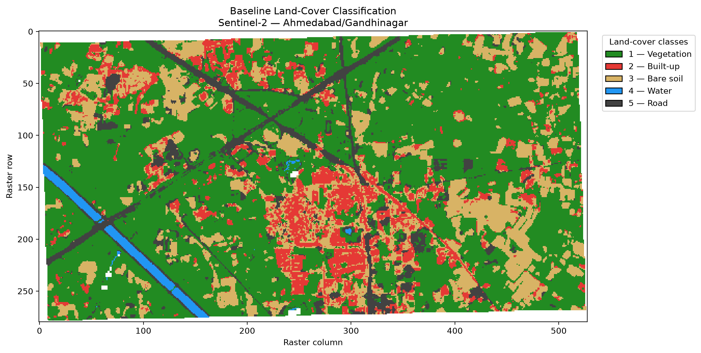
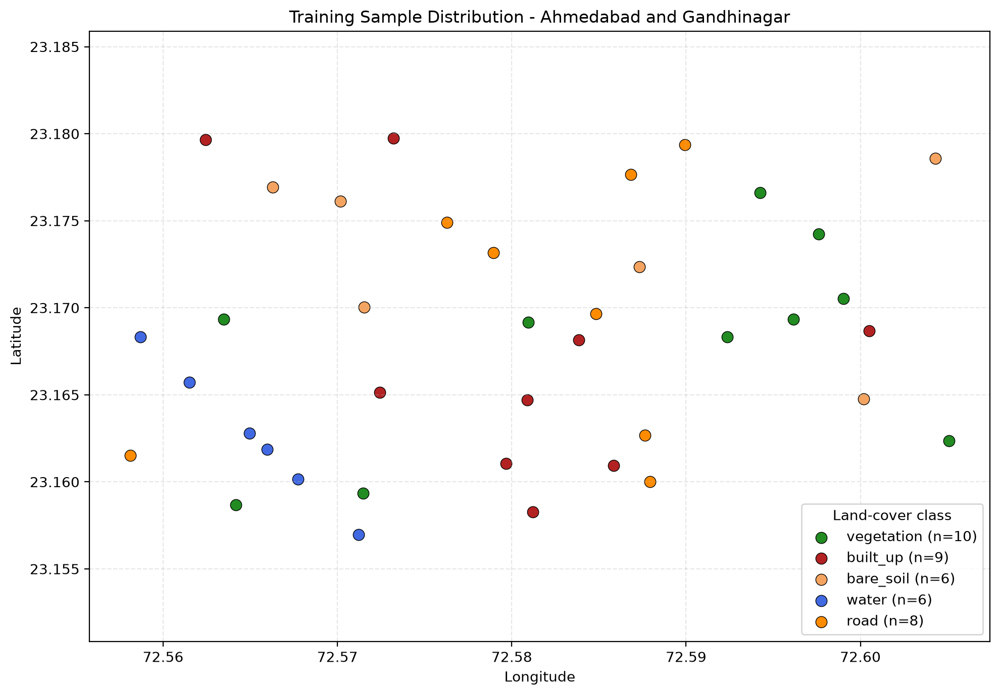

# Satellite Land Cover Classification Using Sentinel-2

A geospatial machine learning project for classifying land cover in the Ahmedabad–Gandhinagar region of Gujarat, India, using Sentinel-2 satellite imagery, spectral indices, and a Random Forest classifier.

## Overview

This project develops a satellite-based land-cover classification workflow using multispectral imagery and supervised machine learning. The workflow combines Sentinel-2 spectral bands with vegetation, water, and built-up indices to generate a raster map of five land-cover classes.

The project includes satellite data preprocessing, spectral feature extraction, labelled sample preparation, model training, classification map generation, and geospatial visualization using QGIS.

### Objectives

- Process and prepare Sentinel-2 satellite imagery for analysis.
- Calculate spectral indices to improve land-cover characterization.
- Prepare labelled training samples from geospatial data.
- Train and evaluate a Random Forest classification model.
- Generate a georeferenced land-cover classification raster.
- Visualize and inspect the results using QGIS.

## Study Area and Data

**Study area:** Ahmedabad–Gandhinagar region, Gujarat, India.

**Satellite data:** Sentinel-2 multispectral imagery.

The project uses spectral bands from the visible, near-infrared, red-edge, and shortwave-infrared regions. The clipped imagery is prepared on a 10-metre reference grid in the UTM coordinate reference system EPSG:32642.

The current study uses a Sentinel-2 scene identified as `T42QZL_20261003T053651`.

The project also uses labelled geospatial training samples stored in a GeoPackage.

## Land-Cover Classes

The classifier predicts five classes:

| Class ID | Class | Description |
|---|---|---|
| 1 | Vegetation | Vegetated surfaces |
| 2 | Built-up | Built or developed surfaces |
| 3 | Bare soil | Exposed soil and similar bare surfaces |
| 4 | Water | Water bodies |
| 5 | Road | Road surfaces |

These classes represent the project's current classification scheme. Their accuracy depends on the quality and representativeness of the labelled training samples.

## Spectral Features

The current Random Forest model uses 13 predictors.

### Sentinel-2 spectral bands

- B02 — Blue
- B03 — Green
- B04 — Red
- B05 — Red Edge 1
- B06 — Red Edge 2
- B07 — Red Edge 3
- B08 — Near Infrared
- B8A — Narrow Near Infrared
- B11 — Shortwave Infrared 1
- B12 — Shortwave Infrared 2

### Spectral indices

- **NDVI — Normalized Difference Vegetation Index:** helps characterize vegetation.
- **NDWI — Normalized Difference Water Index:** helps characterize water-related spectral responses.
- **NDBI — Normalized Difference Built-up Index:** helps characterize built-up surfaces.

Together, these features provide complementary spectral information for distinguishing land-cover classes.

## Technology Stack

| Technology | Purpose |
|---|---|
| Python | Main programming language |
| NumPy | Numerical computation |
| Pandas | Training-data preparation and analysis |
| Rasterio | Raster processing and GeoTIFF operations |
| GeoPandas | Geospatial vector data handling |
| Shapely | Geometric operations |
| PyProj | Coordinate reference system transformations |
| Matplotlib | Data visualization |
| Scikit-learn | Random Forest training and model evaluation |
| Joblib | Saving and loading the trained model |
| Jupyter | Interactive exploration and analysis |
| QGIS | Geospatial visualization and map inspection |

## Project Structure

```text
satellite-land-cover-classification/
├── data/
│   ├── aoi/
│   │   ├── study_area.geojson
│   │   └── training_samples_v2.gpkg
│   ├── raw/
│   │   └── sentinel2/
│   └── processed/
│       └── sentinel2/
├── notebooks/
├── outputs/
│   ├── indices/
│   ├── training_indices/
│   ├── training/
│   ├── models/
│   ├── classification/
│   ├── figures/
│   └── reports/
├── src/
│   ├── preprocessing/
│   ├── features/
│   ├── training/
│   ├── prediction/
│   ├── evaluation/
│   ├── visualization/
│   └── utils/
├── satellite_land_cover.qgz
├── requirements.txt
└── README.md
```

The directories shown represent the intended organization of the project. Some folders may contain additional experimental scripts or generated files.

## Workflow

The core classification workflow consists of the following stages.

### 1. Satellite data preprocessing

Satellite bands are clipped to the study area and prepared for downstream analysis.

Relevant script:

```powershell
python src/preprocessing/clip_satellite_bands.py
```

### 2. Spectral index calculation

Calculate the spectral indices used by the labelled-sample extraction and prediction workflow.

```powershell
python src/features/calculate_training_indices.py
```

### 3. Training-data preparation

Extract the spectral features at labelled training locations and prepare the model-training dataset.

```powershell
python src/training/extract_training_data.py
```

The current training dataset contains 39 labelled samples and 13 predictor features.

### 4. Model training and evaluation

Train the Random Forest baseline and evaluate it using three-fold stratified cross-validation.

```powershell
python src/training/train_model.py
```

The script saves the trained baseline model under `outputs/models/`.

### 5. Land-cover prediction

Apply the trained model to the prepared satellite imagery and generate a georeferenced classification raster.

```powershell
python src/prediction/predict_land_cover.py
```

The baseline classification map is written to:

```text
outputs/classification/land_cover_baseline.tif
```

### 6. Visualization and inspection

Open the classification raster in QGIS to inspect the spatial distribution of the predicted classes. The project also contains scripts for visualizing spectral indices and evaluating alternative classification results.

Run each stage from the project root directory. The required input files must already exist before running a downstream stage.

## Model and Evaluation Results

The current baseline classifier is a **Random Forest** model trained using 300 trees, balanced class weights, and a fixed random seed.

### Baseline performance

| Metric | Result |
|---|---:|
| Cross-validation accuracy | 89.74% |
| Macro F1-score | 0.8926 |
| Number of labelled samples | 39 |
| Number of predictor features | 13 |
| Number of classes | 5 |

### Per-class F1-score

| Class | F1-score |
|---|---:|
| Vegetation | 0.947 |
| Built-up | 0.824 |
| Bare soil | 0.769 |
| Water | 0.923 |
| Road | 1.000 |

The cross-validation confusion matrix shows that built-up and bare-soil samples are sometimes confused with one another. This suggests that these classes deserve particular attention during further feature engineering and training-data collection.

**Evaluation limitation:** These metrics are preliminary. They are based on only 39 labelled samples and three-fold stratified cross-validation. They should not be interpreted as independently verified accuracy for the entire classification map. Spatially independent validation and a larger, more representative dataset are needed for a stronger assessment.

### Exploratory Dynamic World Comparison

A set of 400 candidate points derived from Dynamic World labels was used for exploratory comparison with the Extra Trees classification map. The points represent four Dynamic World categories: Trees, Grass, Flooded vegetation, and Crops, with 100 candidates per category.

The model produced predictions for 394 points; 6 points fell on NoData pixels. The resulting predictions are exploratory only. Dynamic World categories do not map directly to the project's five land-cover classes, and the candidate labels have not been independently verified as ground truth. Therefore, this comparison is not reported as an accuracy assessment.

The analysis is intended to help identify areas for further inspection and potential reference-data collection.

## Visual Results

### Land-cover classification



The classification visualization displays the five mapped classes: vegetation, built-up, bare soil, water, and road. White gaps may represent unclassified or NoData pixels; their meaning should be confirmed against the classification raster before interpretation.

### Training sample distribution



The training-sample map shows the geographic distribution of the 39 labelled samples used in the current workflow. The limited sample size and uneven distribution across classes are important considerations when interpreting the model results.

## Installation

### Prerequisites

- Python 3.10 or a compatible Python version supported by the selected package releases.
- Git, if cloning the repository.
- QGIS, if you want to inspect the raster outputs and project visually.
- Sentinel-2 input data and the required training samples.

### 1. Clone the repository

```powershell
git clone <YOUR_GITHUB_REPOSITORY_URL>
cd satellite-land-cover-classification
```

Replace the placeholder with your actual repository URL.

### 2. Create a virtual environment

On Windows PowerShell:

```powershell
python -m venv .venv
.\.venv\Scripts\Activate.ps1
```

### 3. Install dependencies

Ensure `requirements.txt` includes the project's direct dependencies, including scikit-learn and joblib.

```powershell
python -m pip install --upgrade pip
pip install -r requirements.txt
```

### 4. Prepare input data

Place the required study-area file, training samples, and Sentinel-2 imagery in the expected project directories. Confirm that the filenames and raster grids match the paths expected by the scripts.

## Outputs

The current workflow generates or uses the following artifacts:

| Artifact | Location |
|---|---|
| Labelled training samples | `data/aoi/training_samples_v2.gpkg` |
| Extracted training dataset | `outputs/training_dataset.csv` |
| Whole-image spectral feature matrix | `outputs/training/spectral_features.npz` |
| Whole-image valid-pixel mask | `outputs/training/valid_pixel_mask.tif` |
| Random Forest baseline model | `outputs/models/random_forest_baseline.joblib` |
| Baseline land-cover map | `outputs/classification/land_cover_baseline.tif` |
| Classification visualization | `outputs/figures/land_cover_classification.png` |
| Training sample distribution | `outputs/figures/training_sample_distribution.png` |
| Classification map comparison | `outputs/reports/classification_map_comparison.csv` |
| Spatial cross-validation results | `outputs/reports/spatial_cross_validation_folds.csv` |

The classification raster is a georeferenced GeoTIFF with a 10-metre pixel resolution and EPSG:32642 CRS.
The classification map comparison report summarizes predicted pixel counts for each class across the Random Forest and Extra Trees maps. The spatial cross-validation report records fold-level performance and missing classes. These spatial validation results are exploratory because some folds lack classes in their training or test sets; they should not be interpreted as definitive accuracy estimates.

## Limitations and Future Improvements

The current project provides a working baseline pipeline, but several improvements are needed before the results can be considered robust.

- **Increase training data:** Collect more labelled samples for each class, particularly bare soil and water where sample counts are limited.
- **Improve validation:** Use spatially separated validation samples and, where possible, an independent test dataset.
- **Assess class confusion:** Investigate the spectral similarity between built-up and bare-soil surfaces.
- **Compare models fairly:** Evaluate Random Forest and Extra Trees using consistent data splits and metrics.
- **Validate the final map:** Inspect classification patterns and errors against suitable reference data and high-resolution imagery.
- **Improve reproducibility:** Document the data sources, processing settings, feature definitions, model parameters, and software versions.
- **Improve cartography:** Produce a final map with a legend, scale bar, north arrow, study-area boundary, and supporting class-area statistics.
- **Streamline execution:** Document a reliable end-to-end workflow so the project can be reproduced without manually guessing the execution order.

## Responsible Interpretation

The output is a model-generated land-cover classification, not an authoritative land-use map. Classification errors can result from mixed pixels, shadows, seasonal variation, spectral similarity, cloud contamination, and limited training samples. The map should be used with appropriate validation and uncertainty considerations.

## Author

**Rudrapratapsinh Chauhan**

B.E. in Information Technology

Areas of interest: Machine Learning, Remote Sensing, Geospatial Analysis, and AI Engineering.

## License

Choose and add an appropriate open-source license before publicly distributing the repository. Also verify the licensing and redistribution terms of the satellite imagery and other external datasets used in the project.
