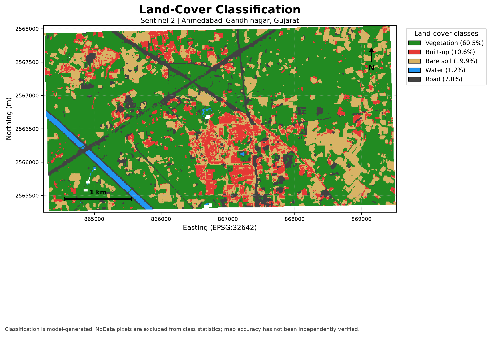
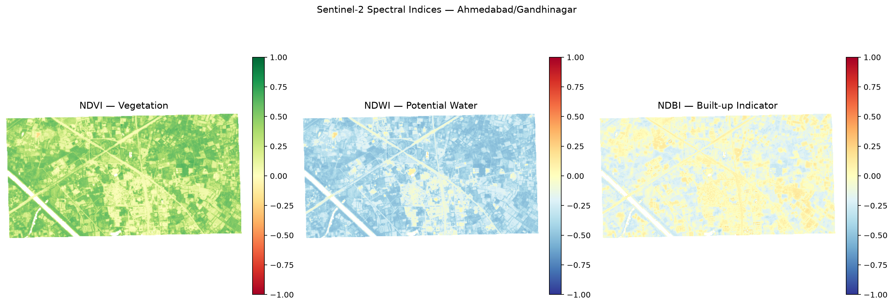
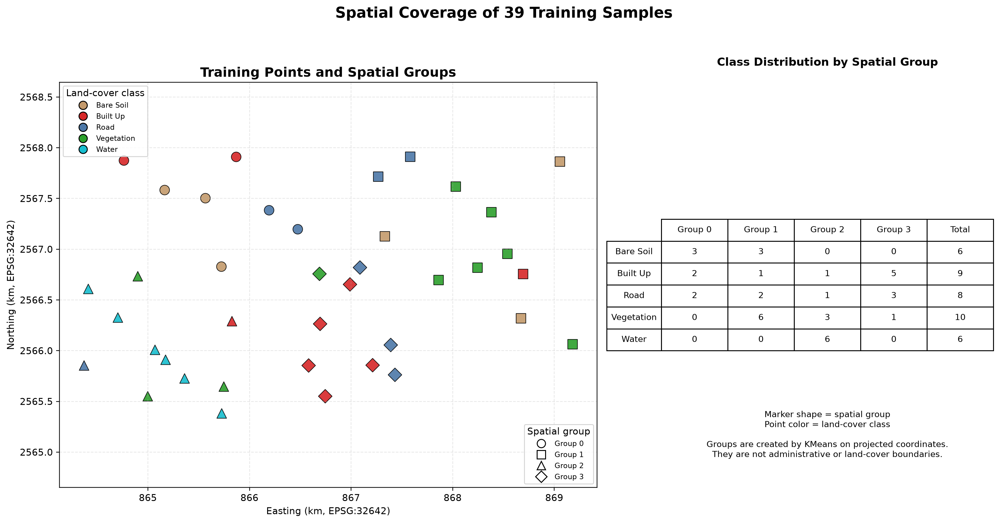

# Satellite Land Cover Classification Using Sentinel-2

An end-to-end geospatial machine-learning workflow for classifying land cover in the Ahmedabad–Gandhinagar region of Gujarat, India, using Sentinel-2 multispectral imagery, spectral indices, classical machine learning, spatial validation, and QGIS.

> **Project status:** Completed portfolio/research workflow
> **Study area:** Ahmedabad–Gandhinagar, Gujarat, India
> **Satellite:** Sentinel-2
> **Spatial resolution:** 10 m reference grid
> **Final classes:** Vegetation, Built-up, Bare Soil, Water, Road

---

## Overview

This project develops an end-to-end pixel-level land-cover classification workflow from Sentinel-2 multispectral imagery.

The pipeline combines:

- Sentinel-2 visible, near-infrared, red-edge, and shortwave-infrared bands
- NDVI, NDWI, and NDBI spectral indices
- Labelled geospatial training samples
- Classical supervised machine-learning models
- Stratified model evaluation
- Geographic/spatial cross-validation
- Pixel-level land-cover prediction
- GeoTIFF generation
- QGIS visualization and mapping

The final workflow is designed as an **experimental/research classification pipeline**, with particular emphasis on understanding spatial generalization and documenting the limitations caused by the small labelled dataset.

---

## Key Highlights

- 🛰️ Sentinel-2 multispectral land-cover classification
- 🧮 13 spectral predictors
- 🌱 NDVI, NDWI, and NDBI feature engineering
- 🤖 Classical ML model comparison
- 🌳 Extra Trees used for the final candidate classification
- 🌍 Geographic spatial cross-validation
- 🗺️ 10 m georeferenced land-cover GeoTIFF
- 🧭 Ahmedabad–Gandhinagar study area
- 🖥️ Reproducible QGIS project
- 📓 Six documented Jupyter notebooks
- ⚠️ Explicit analysis of spatial-validation limitations

---
## Streamlit Land-Cover Classification App

The project includes a Streamlit application for running land-cover inference on multispectral satellite imagery using a trained Extra Trees classifier.

### Features

- Upload multispectral Sentinel-2 GeoTIFF imagery.
- Generate predictions for five land-cover classes: Vegetation, Built-up, Bare soil, Water, and Road.
- View the predicted class distribution and pixel statistics.
- Export the classification raster as a GeoTIFF for further geospatial analysis.

### Installation and Launch

Create and activate a Python virtual environment, then install the app dependencies:

```powershell
python -m venv .venv
.\.venv\Scripts\Activate.ps1
python -m pip install -r requirements-streamlit.txt
```

Launch the application:

```powershell
streamlit run app.py
```

Streamlit will display a local URL in the terminal. Open that URL in your browser to use the application.

### Input Data Requirements

The app requires multispectral GeoTIFF data containing the following ten Sentinel-2 bands:

`B02, B03, B04, B05, B06, B07, B08, B8A, B11, B12`

For a multiband GeoTIFF, the bands must be in this exact order and aligned to a common grid. Alternatively, upload the individual band GeoTIFFs supported by the application.

Ordinary RGB images, screenshots, JPG files, and PNG files do not contain the required multispectral information and are not valid model inputs.

### Model and Interpretation

The Streamlit app loads the committed Extra Trees candidate model from `outputs/models/extra_trees_candidate.joblib`. The Random Forest classifier remains part of the project's baseline training and evaluation workflow.

The application generates model predictions; it does not independently verify the true land cover. Classification results should therefore be treated as exploratory until validated against independent, representative ground-truth samples.

## Study Area and Data

### Study Area

**Ahmedabad–Gandhinagar region, Gujarat, India**

The project uses an AOI covering the selected Ahmedabad–Gandhinagar study region.

### Sentinel-2 Data

The current analysis uses the Sentinel-2 scene:

```text
T42QZL_20261003T053651
```

The processed imagery uses a **10 m reference grid** in:

```text
CRS: EPSG:32642
```

The workflow uses Sentinel-2 bands from visible, near-infrared, red-edge, and shortwave-infrared regions.

---

## Land-Cover Classes

The final classification scheme contains five classes:

| Class ID | Class | Description |
|---:|---|---|
| 1 | Vegetation | Vegetated surfaces |
| 2 | Built-up | Built or developed surfaces |
| 3 | Bare Soil | Exposed soil and other bare surfaces |
| 4 | Water | Water bodies |
| 5 | Road | Road surfaces |

These classes represent the project's current experimental classification scheme. Their performance depends strongly on the quality, quantity, and spatial representativeness of the labelled samples.

---

## Spectral Features

The final feature space contains **13 predictors**.

### Sentinel-2 bands

| Band | Description |
|---|---|
| B02 | Blue |
| B03 | Green |
| B04 | Red |
| B05 | Red Edge 1 |
| B06 | Red Edge 2 |
| B07 | Red Edge 3 |
| B08 | Near Infrared |
| B8A | Narrow Near Infrared |
| B11 | Shortwave Infrared 1 |
| B12 | Shortwave Infrared 2 |

### Spectral indices

**NDVI — Normalized Difference Vegetation Index**

Used to characterize vegetation-related spectral response.

**NDWI — Normalized Difference Water Index**

Used to provide additional information for water-related spectral response.

**NDBI — Normalized Difference Built-up Index**

Used to provide additional information for built-up surfaces.

Together, the 10 Sentinel-2 bands and three spectral indices provide a 13-dimensional feature representation for the supervised classification workflow.

---

## Methodology

```text
Sentinel-2 imagery
        │
        ▼
AOI clipping & preprocessing
        │
        ▼
Spectral bands
        │
        ├── NDVI
        ├── NDWI
        └── NDBI
        │
        ▼
13-dimensional spectral feature set
        │
        ▼
Labelled training samples
        │
        ▼
Data cleaning & feature extraction
        │
        ▼
ML model comparison
        │
        ▼
Model evaluation
        │
        ├── Stratified cross-validation
        └── Geographic spatial validation
        │
        ▼
Final candidate model
        │
        ▼
Pixel-level prediction
        │
        ▼
Land-cover GeoTIFF
        │
        ▼
QGIS visualization
```

---

# Dataset and Training Samples

The initial labelled dataset contained **39 samples**.

After cleaning invalid/incomplete training records, **33 valid samples** remained for the final cleaned training dataset.

The cleaned dataset contained:

| Class | Valid samples |
|---|---:|
| Vegetation | 10 |
| Built-up | 9 |
| Road | 8 |
| Bare Soil | 6 |
| Water | 0* |

\*The final cleaned training dataset used for the modelling workflow contained 33 valid samples across the retained classes; water samples were present in the original labelled set and became important in the spatial-validation analysis. The spatial grouping revealed that all six water samples were concentrated in one geographic group, which prevented some spatial folds from being evaluated normally.

Because of the very small dataset, the reported model metrics should be treated as **experimental diagnostics rather than independently verified map accuracy**.

---

# Model Evaluation

The project evaluates model behaviour using both conventional stratified validation and geographic validation.

These two evaluation approaches answer different questions.

### Stratified validation

Tests model performance when samples are divided while maintaining class representation.

### Spatial validation

Tests whether the learned relationships transfer to geographically separated samples.

The spatial evaluation is especially important for satellite imagery because nearby pixels can be spectrally similar. A random split can therefore provide an optimistic estimate of generalization.

---

## Spatial Cross-Validation Results

Four geographic groups were evaluated.

| Fold | Training Samples | Validation Samples | Accuracy | Macro F1 | Status |
|---:|---:|---:|---:|---:|---|
| 1 | 27 | 12 | 0.9167 | 0.5714 | Evaluated |
| 2 | 28 | 11 | — | — | Skipped — water missing from training |
| 3 | 30 | 9 | 0.4444 | 0.1600 | Evaluated |
| 4 | 32 | 7 | 1.0000 | 0.6000 | Evaluated |

Across the **three evaluated folds**:

| Metric | Mean |
|---|---:|
| Accuracy | **78.70%** |
| Macro F1 | **0.4438** |

The skipped fold is intentionally excluded from these means.

### Why was Fold 2 skipped?

All six water samples were concentrated within one spatial group.

When that group was used as validation data, the corresponding training partition contained no water examples. A meaningful supervised classification metric could therefore not be computed for that fold.

Rather than artificially assigning a score, the workflow records the fold as:

```text
skipped_missing_training_class
```

This is an important finding about the limitations of the current sampling design.

---

## Interpretation of Spatial Validation

The spatial results demonstrate that geographic generalization is substantially more difficult than conventional random/stratified validation.

The large variation between folds indicates that the current dataset is:

- very small,
- spatially uneven,
- class-imbalanced across geographic groups,
- and insufficient for a reliable estimate of real-world map accuracy.

The spatial-validation experiment is therefore treated as an **exploratory diagnostic**, not as a definitive accuracy assessment.

A larger and independently verified spatial reference dataset would be required for a stronger scientific evaluation.

---

# Final Classification

The project produced a pixel-level land-cover classification raster using the selected Extra Trees candidate model.

### Final candidate output

```text
outputs/classification/land_cover_extra_trees.tif
```

A Random Forest baseline is also retained for comparison:

```text
outputs/classification/land_cover_baseline.tif
```

The classification outputs are georeferenced GeoTIFF rasters on the project's 10 m reference grid.

---

# Visual Results

### Land-Cover Classification

The final classification visualization shows the five target classes:

- Vegetation
- Built-up
- Bare Soil
- Water
- Road



### Spectral Indices

The project also generates visual previews of the derived spectral indices.



### Training Sample Distribution

The spatial distribution of labelled training samples is important for interpreting the spatial-validation results.



---

# QGIS Visualization

A reproducible QGIS project is included:

```text
satellite_land_cover_reproducible.qgz
```

The project was cleaned to use relative project paths for its required local data dependencies.

The reproducible project references:

```text
outputs/classification/land_cover_baseline.tif
outputs/classification/land_cover_extra_trees.tif
outputs/training_indices/ndwi.tif
data/aoi/study_area.geojson
data/aoi/training_samples_v2.gpkg
```

The QGIS project includes a final land-cover map layout with the five classification classes.

The original QGIS project and local backup files are not required for reproducing the committed project.

---

# Project Structure

```text
satellite-land-cover-classification/
│
├── data/
│   └── aoi/
│       ├── study_area.geojson
│       └── training_samples_v2.gpkg
│
├── notebooks/
│   ├── 01_data_exploration.ipynb
│   ├── 02_spectral_indices.ipynb
│   ├── 03_training_data_analysis.ipynb
│   ├── 04_model_evaluation.ipynb
│   ├── 05_classification_visualization.ipynb
│   └── 06_aoi_transfer_test.ipynb
│
├── outputs/
│   ├── classification/
│   │   ├── land_cover_baseline.tif
│   │   └── land_cover_extra_trees.tif
│   ├── figures/
│   ├── reports/
│   └── training_indices/
│       └── ndwi.tif
│
├── src/
│   ├── evaluation/
│   └── visualization/
│
├── app.py
├── requirements-streamlit.txt
├── src/
│   └── inference/
│       ├── __init__.py
│       └── predict.py
├── tests/
│   ├── test_upgrade.py
│   └── test_real_data.py
├── satellite_land_cover_reproducible.qgz
├── requirements.txt
└── README.md
```

Some generated or experimental files are intentionally excluded from the reproducible core workflow.

---

# Notebooks

The analysis is organized into six notebooks.

| Notebook | Purpose |
|---|---|
| `01_data_exploration.ipynb` | Explore Sentinel-2 data, AOI, bands, and raster properties |
| `02_spectral_indices.ipynb` | Calculate and inspect NDVI, NDWI, and NDBI |
| `03_training_data_analysis.ipynb` | Inspect and analyse labelled training samples |
| `04_model_evaluation.ipynb` | Compare and evaluate machine-learning models |
| `05_classification_visualization.ipynb` | Visualize classification results and model outputs |
| `06_aoi_transfer_test.ipynb` | Examine model behaviour for spatial/AOI transfer |

---

# Source Code

The project also contains reusable evaluation and visualization utilities.

Important components include:

```text
src/evaluation/
├── spatial_cross_validation.py
├── spatial_cross_validation_2_groups.py
└── plot_training_point_distribution.py

src/visualization/
├── create_final_map.py
└── create_final_report.py
```

The spatial-validation code explicitly records skipped folds and missing training classes instead of silently dropping problematic results.

---

# Technology Stack

| Technology | Purpose |
|---|---|
| Python | Main programming language |
| NumPy | Numerical computation |
| Pandas | Data preparation and analysis |
| Rasterio | Raster processing and GeoTIFF operations |
| GeoPandas | Vector geospatial processing |
| Shapely | Geometry operations |
| PyProj | CRS transformations |
| Matplotlib | Visualization |
| Scikit-learn | Machine-learning models and evaluation |
| Joblib | Model serialization |
| Jupyter | Interactive analysis |
| QGIS | Geospatial visualization and map production |
| Streamlit | Interactive web application for satellite classification |
| Extra Trees | Classification model used by the Streamlit inference app |

---

# Reproducibility

The committed workflow separates analysis notebooks, source code, data, and generated outputs.

The QGIS project uses relative paths for its committed local dependencies rather than user-specific Windows paths.

The repository also includes the small raster dependency:

```text
outputs/training_indices/ndwi.tif
```

so that the reproducible QGIS project does not depend on an ignored local NDWI file.

Large raw Sentinel-2 source imagery is not included in the repository.

To reproduce the complete processing workflow, the required Sentinel-2 input data must be obtained separately and placed in the expected project locations.

---

# Installation

## Requirements

- Python 3.10+ compatible environment
- Git
- QGIS for geospatial visualization
- Required Sentinel-2 source imagery for rerunning the complete preprocessing workflow

## Clone the repository

```powershell
git clone https://github.com/Rudrapratapsinh-Chauhan1507/satellite-land-cover-classification.git
cd satellite-land-cover-classification
```

## Create a virtual environment

Windows PowerShell:

```powershell
python -m venv .venv
.\.venv\Scripts\Activate.ps1
```

## Install dependencies

```powershell
python -m pip install --upgrade pip
pip install -r requirements.txt
```

The exact execution order of individual processing scripts may depend on the availability and location of the source Sentinel-2 imagery and generated intermediate data.

For the documented analysis, the notebooks provide the clearest record of the executed workflow.

---

# Outputs

Important project outputs include:

| Output | Location |
|---|---|
| Study area | `data/aoi/study_area.geojson` |
| Training samples | `data/aoi/training_samples_v2.gpkg` |
| Training dataset | `outputs/training_dataset.csv` |
| Random Forest baseline | `outputs/classification/land_cover_baseline.tif` |
| Extra Trees classification | `outputs/classification/land_cover_extra_trees.tif` |
| NDWI raster | `outputs/training_indices/ndwi.tif` |
| Classification figures | `outputs/figures/` |
| Evaluation reports | `outputs/reports/` |
| Streamlit app | `app.py` |
| Streamlit dependencies | `requirements-streamlit.txt` |
| Extra Trees inference model | `outputs/models/extra_trees_candidate.joblib` |
| Reproducible QGIS project | `satellite_land_cover_reproducible.qgz` |

---

# Limitations

The current project is a complete experimental workflow, but it is **not a production-grade or independently validated land-cover mapping system**.

### 1. Small labelled dataset

The original labelled dataset contained only 39 samples, with 33 valid samples remaining after cleaning.

This is very small for a five-class satellite classification problem.

### 2. Spatial sampling imbalance

The samples are not evenly distributed geographically.

All six original water samples were concentrated in one spatial group, causing one spatial-validation fold to lack water in its training partition.

### 3. Spatial performance instability

Spatial validation produced substantially different results across geographic folds.

This indicates that the current model's performance is sensitive to where the training and validation samples are located.

### 4. No independent ground-truth benchmark

The current metrics should not be interpreted as independently verified accuracy for the entire satellite scene.

### 5. Mixed pixels and spectral similarity

At 10 m resolution, individual pixels can contain mixtures of land-cover types.

Built-up surfaces and bare soil can also have similar spectral responses, making them difficult to separate reliably with a small training dataset.

### 6. Scene-specific analysis

The current workflow is based on a specific Sentinel-2 acquisition and study area. Performance may change across different dates, seasons, geographic regions, atmospheric conditions, and land-cover distributions.

---

# Future Improvements

The most valuable next improvements would be:

1. **Collect substantially more labelled samples**
2. **Improve geographic coverage of the training data**
3. **Create an independently verified test dataset**
4. **Increase the number of samples for water and bare-soil classes**
5. **Perform consistent model comparison using identical spatial splits**
6. **Investigate class-specific confusion and spectral separability**
7. **Test the workflow across additional Sentinel-2 acquisition dates**
8. **Evaluate transferability to a second geographic AOI**
9. **Add uncertainty/confidence analysis for the final map**
10. **Validate classification results against reliable reference data**

The priority should be **better reference data and spatial validation**, rather than simply adding more complex machine-learning algorithms.

---

# Responsible Interpretation

This output is a **model-generated land-cover classification**, not an authoritative land-use or land-cover map.

Potential sources of error include:

- Limited training samples
- Spatial sampling bias
- Mixed pixels
- Spectral similarity between classes
- Shadows
- Seasonal variation
- Atmospheric/cloud effects
- Differences between training and prediction regions

The classification should therefore be interpreted together with its validation results and known dataset limitations.

---

# Project Outcome

This project demonstrates an end-to-end application of:

**Remote Sensing + Machine Learning + Geospatial Processing + Spatial Validation + QGIS**

The main technical lesson from the project is that a high conventional validation score does not necessarily imply strong geographic generalization. The spatial cross-validation experiment exposed weaknesses in the current training-data distribution and provided a more realistic view of the model's limitations.

---

# Author

**Rudrapratapsinh Chauhan**

B.E. in Information Technology

Interests:

- Machine Learning
- Remote Sensing
- Geospatial Analysis
- AI Engineering

---

## License and Data

Before adding a formal open-source license, verify the licensing and redistribution terms of all external datasets and satellite imagery used in the project.

The repository does not redistribute the original raw Sentinel-2 imagery.
